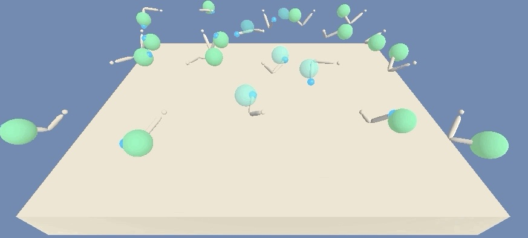

# DRL_Reacher_Project
Reacher project: Train an agent via a deep reinforcement algorithm to complete a task in a `3d` environment (continuous states, continuous actions)). 

For an introduction to reinforcement learning and deep reinforcement learning in particular as applied to a similar training problem, we refer to [Cartpole - Introduction to Reinforcement Learning (DQN - Deep Q-Learning)](https://towardsdatascience.com/cartpole-introduction-to-reinforcement-learning-ed0eb5b58288). For an application of the Deep Q-Learning algorithm to a similar environment, we refer to the following github entry: [Solving Unity's Banana Collector environment via DQL](https://github.com/andreaspts/DRL_Navigation_Project).

In this repository, we seek to apply the DDPG (deep deterministic policy gradient) algorithm to solve the given environment. For details regarding this algorithm, we refer to the original literature ([article 1](http://proceedings.mlr.press/v32/silver14.pdf) and [article 2](https://arxiv.org/abs/1509.02971)) and the following highly recommendable [link](https://spinningup.openai.com/en/latest/algorithms/ddpg.html). For another application of the DDPG algorithm to the classic inverted pendulum task, we refer to the following [blog post](https://towardsdatascience.com/deep-deterministic-policy-gradients-explained-2d94655a9b7b).

### Introduction

<p align="center">
  
</p>

In this problem a single agent learns to move a double-jointed arm to reach to target locations. The above-given picture illustrates that the environment and code used here could in principle be extended to cover the training of `20` agents simultaneously.

The agent obtains a reward of `+0.1` for each step that the agent's hand is in the targeted position. The overall goal of the agent is to keep its position exactly there for as long as possible.

The observation space has `33` variables (all of which are continuous) which correspond to position, rotation, velocity, and angular velocities of the arm. The agent is allowed to take actions, each of which is a vector with four numbers. The action corresponds to the torque applied to two joints. The entries of the action vector vary continuously between between `-1` and `1`.

For completeness, we give the Unity details of the environment:

```
INFO:unityagents:
'Academy' started successfully!
Unity Academy name: Academy
        Number of Brains: 1
        Number of External Brains : 1
        Lesson number : 0
        Reset Parameters :
		goal_speed -> 1.0
		goal_size -> 5.0
Unity brain name: ReacherBrain
        Number of Visual Observations (per agent): 0
        Vector Observation space type: continuous
        Vector Observation space size (per agent): 33
        Number of stacked Vector Observation: 1
        Vector Action space type: continuous
        Vector Action space size (per agent): 4
        Vector Action descriptions: , , , 
```
### Getting Started

To run version `1` of the environment (needed for the training of one `(1)` agent) it has to be downloaded first. For individual operating systems it can be obtained from:
* Linux: [click here](https://s3-us-west-1.amazonaws.com/udacity-drlnd/P2/Reacher/one_agent/Reacher_Linux.zip)
* Mac OSX: [click here](https://s3-us-west-1.amazonaws.com/udacity-drlnd/P2/Reacher/one_agent/Reacher.app.zip)
* Windows (32-bit): [click here](https://s3-us-west-1.amazonaws.com/udacity-drlnd/P2/Reacher/one_agent/Reacher_Windows_x86.zip)
* Windows (64-bit): [click here](https://s3-us-west-1.amazonaws.com/udacity-drlnd/P2/Reacher/one_agent/Reacher_Windows_x86_64.zip)

To run version `2` of the environment (needed for the training of one `(20)` agenta) it has to be downloaded. For individual operating systems it can be obtained from:
* Linux: [click here](https://s3-us-west-1.amazonaws.com/udacity-drlnd/P2/Reacher/Reacher_Linux.zip)
* Mac OSX: [click here](https://s3-us-west-1.amazonaws.com/udacity-drlnd/P2/Reacher/Reacher.app.zip)
* Windows (32-bit): [click here](https://s3-us-west-1.amazonaws.com/udacity-drlnd/P2/Reacher/Reacher_Windows_x86.zip)
* Windows (64-bit): [click here](https://s3-us-west-1.amazonaws.com/udacity-drlnd/P2/Reacher/Reacher_Windows_x86_64.zip)

Computations were done using python 3.7. In addition, the following packages were mounted: **matplotlib**, **numpy**, **torch** and **unityagents** which is used to run the [Reacher environment](https://github.com/Unity-Technologies/ml-agents/blob/master/docs/Learning-Environment-Examples.md#reacher).

### Instructions

The project can be run by starting the **Jupiter** notebook `Reacher_DDPG_solution.ipynb`. In this notebook classes are called which define the learning agent and the neural network which are saved in `ddpg_agent.py` and `model.py`, respectively. Results of the analysis are collected in the `report.md` file.

### License
This repository is licensed under the MIT License.
