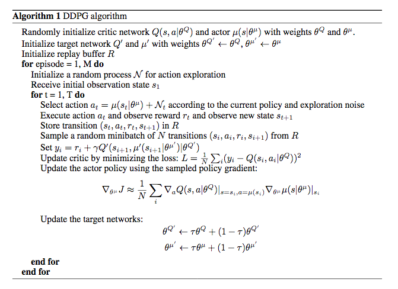
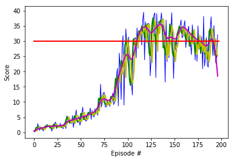

# Project report

## Aspects of the learning algorithm

### Description of the DDPG (deep deterministic policy gradient) algorithm

The employed learning algorithm is the DDPG algorithm which was introduced in the articles [Deterministic Policy Gradient Algorithms](http://proceedings.mlr.press/v32/silver14.pdf) and [Continuous control with deep reinforcement learning](https://arxiv.org/abs/1509.02971) to solve [Markov Decision Processes](https://en.wikipedia.org/wiki/Markov_decision_process) with continuous action spaces.

At the heart of the learning agent are two deep neural networks which act as concurrent function approximators, i.e., they learn a Q-function (in an off-policy way via the Bellman equation) and a deterministic policy (via the Q-function) in parallel. Hence, it is a so-called [actor-critic approach](https://towardsdatascience.com/understanding-actor-critic-methods-931b97b6df3f) where the actor is represented by the first and the critic by the second network.

More precisely, the actor network approximates the optimal deterministic policy which implies that the returned action `a` is the best one for any fed-in state `s`. In other words, it approximates the `argmax_a(Q(s,a))`-function. The state and action are fed into the, the critic to approximate the optimal action-value function through the input of the actor’s best action. Both networks have target networks (as in the standard deep Q-learning algorithm) to stabilize the algorithm. The respective target networks are copied over from their main counterpart networks every update step. (This could also be changed to an update every `4` steps with minimal changes to the code.)

These points become clearer when following the pseudo-code as taken from the [original literature](https://arxiv.org/abs/1509.02971):

<p align="center">
  
</p>

Some explanations are in order:

1. Fed with a state `s`, the actor network returns an action `a`. After `a` is returned, we also add some noise to the action to encourage stochastic exploration and call this action `a`. The noise is generated through a [Ornstein-Uhlenbeck process](https://en.wikipedia.org/wiki/Ornstein%E2%80%93Uhlenbeck_process).

2. Taking the action `a` leads to a release of the reward `r` and setting the environment to the state `s'`. This gives the experience tuple `<s,a,r,s'>` which is saved in the replay memory up to a particular buffer size. The tuples are added gradually step by step, episode by episode to the buffer.

3. We randomly select a small batch of tuples from this memory and learn from that batch via gradient descent the optimal action-value function and via gradient ascent the optimal deterministic policy. 

More precisely,

for every tuple in the batch:
3.a. We compute the target Q-value. This is done by pluggin `s'` into the target actor network, leading to the next action `a'`. This is put into the target critic network to obtain the next Q-value `Q'`. When discount factor is multiplied to this value and the reward `r` is added we have obtained the target Q-values.

3.b. We compute the expected Q-value from the local critic network from the current state and action. From the expected Q-value and the target Q-value we gain the Temporal Difference error.

3.c. Using this info from all tuples, we obtain the mean squared error which is minimized through gradient descent leading to an update of the weights of the target critic network. For this we use the MSELoss loss function (aka L2 loss function) and an Adam optimizer. The latter is also fed with the learning rate determining the speed of the gradient descent.

3.d. With this we are ready to update the actor policy via gradient ascent. For this a new action is obtained by plugging the state `s` into the local actor network. Then Q-values are obtained by plugging the new action and `s` into the local critic network. With this we obtain the actor loss function `J` which is to be maximized thereafter. We observe that in the pseudo-code the chain rule is applied. In the code, one simply performs the update of the actor via

```
        # Compute actor loss
        actions_pred = self.actor_local(states)
        actor_loss = -self.critic_local(states, actions_pred).mean()
        # Minimize the loss
        self.actor_optimizer.zero_grad()
        actor_loss.backward()
        self.actor_optimizer.step()
```

4. Finally, a "soft update" of the model parameters connects the local and target models (via Polyak averaging) and is responsible for resetting of weights of the target networks.


### Architectures of the used networks

We are using two simple deep neural networks for both the actor and critic. They are built from `2` fully connected hidden layers coded into the model.py file. In particular, for the actor we have

- Fully connected layer - input: `33` (state_size) output: `128` (fc1_units) with ReLU activation
- Fully connected layer - input: `128` (fc1_units) output: `128` (fc2_units) with ReLU activation
- Fully connected layer - input: `128` (fc2_units) output: `4` (action_size) with tanh activation

where we also apply batch normalization after the first layer to improve gradient ascent. 

For the critic we have

- Fully connected layer - input: `33` (state_size) output: ``128 (fc1_units) with ReLU activation
- Fully connected layer - input: `132` (fc1_units+action_size) output: `128` (fc2_units) with ReLU activation
- Fully connected layer - input: `128` (fc2_units) (Q-value) output: `1`

where we also apply batch normalization after the first layer to improve gradient descent. Notice the number of input nodes in the second layer which amounts to `fc1_units+action_size=132`. The concatenation reflects the particular concurrence of the two networks.


### Specification of parameters used in the DDPG algorithm

We speficy the parameters used in the DDPG algorithm (as in the ddpg-function of the Reacher_DDPG_solution.ipynb notebook):

- We set the number of episodes n_episodes to `2000`. The number of episodes needed to solve the environment and reach a score of `30.0` is expected to be smaller.
- We set the maximum number of steps per episode max_t to `1500`.

Furthermore, we give the parameters used in the `ddpg_agent.py` file:

- The size of the replay buffer BUFFER_SIZE is set to `10^6`.
- The mini batch size BATCH_SIZE is set to `128`.
- The discount factor GAMMA for future rewards is set to `0.99`.
- For both networks, we set the value for the soft update of the target parameters TAU to `10^-3`.
- The learning rate for the gradient descent for the actor network LR_ACTOR is set to `2 * 10^-4`.
- The learning rate for the gradient descent for the critic network LR_CRITIC is set to `2 * 10^-4`.
- The parameter to control the L2 weight decay WEIGHT_DECAY is set to `0`.

For the [Ornstein-Uhlenbeck noise](https://en.wikipedia.org/wiki/Ornstein%E2%80%93Uhlenbeck_process), we used the parameters (as specified in the previous link):
- `mu=0`
- `theta = 0.15` and
- `sigma = 0.1`.

The noise is added to the agent's actions at training time to make it explore better. The consideration of such noise is heuristic so that stochastic exploration is encouraged (see above). 


## Results

With the above specifications we create a training run and report the results. 

We give a plot of the scores over the episodes:

<p align="center">
  
</p>

Therein, we applied a simple and exponential moving average function at window sizes of `3` (green plot and yellow plot, respectively) overlaying the original data (blue). The red line indicates the threshold of `30.0` reward points. More information on how to construct these moving averages in python can be found under the following links:
[Moving average in python](https://www.quora.com/How-do-I-perform-moving-average-in-Python) and [Exponential Moving average in python](https://www.youtube.com/watch?v=3y9GESSZmS0). Notice that the exponential moving average gives more emphasis to recent data than the simple version of it. 
In general, [moving averages](https://en.wikipedia.org/wiki/Moving_average) are a method to smoothen time and data series. 
Yet another plot (in magenta) depicts a running average with a Gaussian type of window which provides a much better smoothening as compared to the others (at least up to closely before the last episodes).
The steep fall off is due to the parameters chosen in the Gaussian averaging function and shall not be of any concern here.

Then we list the average score every `100` episodes up to the point where the agent reaches a score equal or higher than `30.0`: 

```
Episode 185	Average Score: 28.70	Score: 31.16
Episode 186	Average Score: 28.83	Score: 22.17
Episode 187	Average Score: 28.95	Score: 21.46
Episode 188	Average Score: 29.10	Score: 28.78
Episode 189	Average Score: 29.24	Score: 32.95
Episode 190	Average Score: 29.41	Score: 38.00
Episode 191	Average Score: 29.64	Score: 31.10
Episode 192	Average Score: 29.63	Score: 25.21
Episode 193	Average Score: 29.77	Score: 35.09
Episode 194	Average Score: 29.95	Score: 28.50
Episode 195	Average Score: 29.90	Score: 22.82
Episode 196	Average Score: 29.83	Score: 24.78
Episode 197	Average Score: 30.06	Score: 32.05

Environment solved in 197 episodes!	Average Score: 30.06
```

We note here that on different test runs, the environment was solved in about `230` and `480` episodes which indicates the instability of the algorithm. This could call for the implementation of a more stable algorithm as discussed below.


## Possible extensions of the setting and future work

1. The hyperparameters should be optimized: For example, we could change the learning rate, the batch size and improve the network structure (more/less layers and units; overfitting could be tackled using dropout or L2 regularization).

2. While the original DDPG paper advocated the use of time-correlated [Ornstein-Uhlenbeck noise](https://en.wikipedia.org/wiki/Ornstein%E2%80%93Uhlenbeck_process), it has been suggested to apply uncorrelated, mean-zero Gaussian noise. The learning behavior with these different noises could be compared.

3. The training could be repeated for the version `2` of the environment to check how the 'learning behavior' is changed 

4. [Prioritized Experience Replay](https://arxiv.org/abs/1511.05952) could be implemented. In this work the authors extend the idea of experience replay. They introduce a method which prioritizes experiences by replaying important transitions more often which accelerates the learning rate. 

5. The environment could be solved using different algorithms. In particular, 

5.a. more stable methods are the Trust Region Policy Optimization (TRPO) and Truncated Natural Policy Gradient (TNPG) which were introduced [here](https://arxiv.org/abs/1604.06778).

5.b the second version of the environment could be tackled with the [PPO](https://arxiv.org/pdf/1707.06347.pdf), [A3C](https://arxiv.org/pdf/1602.01783.pdf), and [D4PG](https://openreview.net/pdf?id=SyZipzbCb) algorithms. They can distribute the work of gathering experience to multiple (non-interacting) copies of the same agent.
